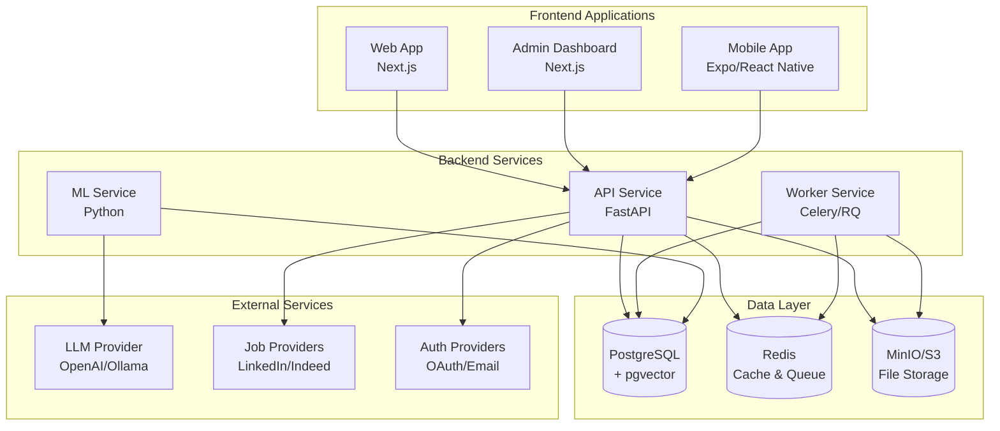
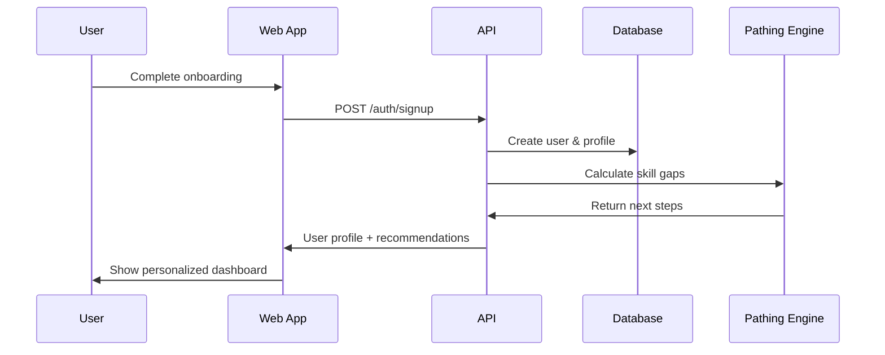
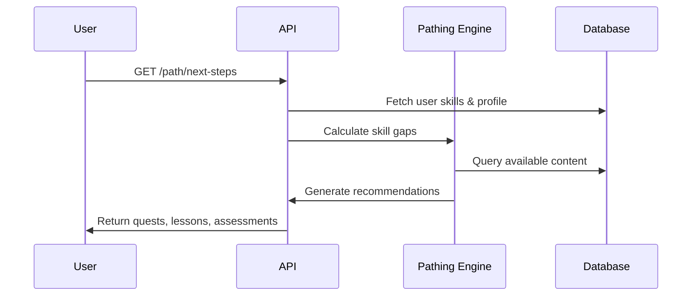
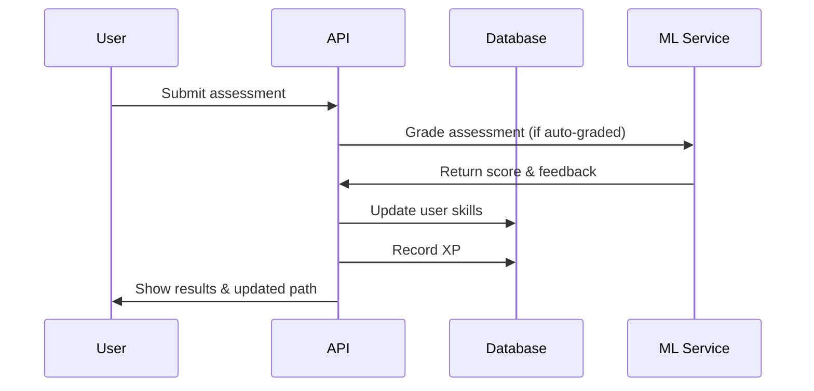

# EverPath Architecture

## System Overview

EverPath is a monorepo-based career and education pathing platform with the following architecture:



## Core Components

### 1. Frontend Applications

#### Web App (`apps/web`)
- **Framework**: Next.js 14 with App Router
- **Styling**: Tailwind CSS + shadcn/ui
- **Features**:
  - User onboarding and skill assessment
  - Personalized learning paths
  - Job recommendations
  - Progress tracking
  - Kids mode with Curio Critters integration

#### Admin Dashboard (`apps/admin`)
- **Framework**: Next.js 14
- **Features**:
  - Content management (lessons, quests, assessments)
  - User management and moderation
  - Analytics and reporting
  - System configuration

#### Mobile App (`apps/mobile` - Future)
- **Framework**: Expo/React Native
- **Features**:
  - Mobile-optimized learning experience
  - Offline lesson caching
  - Push notifications

### 2. Backend Services

#### API Service (`services/api`)
- **Framework**: FastAPI (Python)
- **Database**: SQLModel (SQLAlchemy + Pydantic)
- **Key Features**:
  - RESTful API with OpenAPI documentation
  - JWT-based authentication
  - Pathing engine for skill gap analysis
  - Content delivery and assessment handling
  - Job matching and recommendations

#### Worker Service (`services/worker`)
- **Framework**: Celery or RQ
- **Purpose**: Background job processing
- **Tasks**:
  - Email notifications
  - Data processing and ETL
  - Assessment grading
  - Job data synchronization

#### ML Service (`services/ml`)
- **Framework**: Python with scikit-learn, transformers
- **Features**:
  - Skill estimation from assessments
  - Personalized content recommendations
  - Job matching algorithms
  - LLM integration for interview practice

### 3. Data Layer

#### PostgreSQL Database
- **Primary data store** for all structured data
- **Extensions**: pgvector for embeddings and similarity search
- **Schema**: Normalized relational design with skills graph

#### Redis
- **Session storage** for authentication
- **Cache** for frequently accessed data
- **Message broker** for background jobs

#### MinIO/S3
- **File storage** for user artifacts, resumes, media
- **Content delivery** for lesson materials

## Data Flow

### User Onboarding Flow


### Learning Path Generation


### Assessment Flow


## Key Algorithms

### Pathing Engine v0
```python
def calculate_next_steps(user_profile, user_skills, target_role):
    # 1. Compute skill gaps
    gaps = {}
    for required_skill in target_role.required_skills:
        user_level = user_skills.get(required_skill.id, 0)
        gap = max(0, required_skill.level - user_level)
        gaps[required_skill.id] = gap
    
    # 2. Weight by importance
    weighted_gaps = {skill_id: gap * weight 
                    for skill_id, gap, weight in gaps}
    
    # 3. Select top skills
    top_skills = sorted(weighted_gaps.items(), 
                       key=lambda x: x[1], reverse=True)[:3]
    
    # 4. Generate recommendations
    recommendations = []
    for skill_id, gap in top_skills:
        quests = get_quests_for_skill(skill_id, difficulty_order)
        assessment = get_assessment_for_skill(skill_id)
        recommendations.extend([quests, assessment])
    
    # 5. Add job leads for adults
    if user_profile.age_band in ['18-24', '25-34', '35-44', '45+']:
        job_leads = get_job_leads(target_role, user_profile.location)
        recommendations.append(job_leads)
    
    return recommendations
```

### Skill Graph
- **Nodes**: Skills with proficiency levels
- **Edges**: Prerequisites and relatedness
- **Traversal**: BFS for learning path generation
- **Scoring**: Cosine similarity for job matching

## Security Architecture

### Authentication & Authorization
- **JWT tokens** with role-based access control
- **OAuth2** integration for social login
- **Magic links** for passwordless authentication
- **Parental controls** for kids accounts

### Data Protection
- **PII encryption** at rest
- **Secure session management**
- **API rate limiting**
- **Content filtering** by age

### Compliance
- **COPPA compliance** for children's data
- **GDPR compliance** for EU users
- **Data export/delete** functionality
- **Consent management**

## Scalability Considerations

### Horizontal Scaling
- **Stateless API** design
- **Database connection pooling**
- **Redis cluster** for session storage
- **CDN** for static assets

### Performance Optimization
- **Database indexing** on frequently queried fields
- **Query optimization** with EXPLAIN ANALYZE
- **Caching strategy** for content and recommendations
- **Background processing** for heavy operations

### Monitoring & Observability
- **OpenTelemetry** for distributed tracing
- **PostHog** for analytics and feature flags
- **Health checks** for all services
- **Error tracking** with structured logging

## Integration Points

### External APIs
- **Job Providers**: LinkedIn, Indeed, Greenhouse, Lever
- **Learning Content**: Open educational resources
- **Authentication**: Google, Microsoft, Apple OAuth
- **LLM Services**: OpenAI, Anthropic, local models

### Data Import/Export
- **Resume parsing** for skill extraction
- **Portfolio export** as PDF/HTML
- **Progress reporting** for educators
- **Data migration** tools

## Development Workflow

### Monorepo Structure
```
everpath/
├── apps/
│   ├── web/          # Next.js web app
│   ├── admin/        # Admin dashboard
│   └── mobile/       # React Native app
├── packages/
│   ├── ui/           # Shared components
│   └── tsconfig/     # TypeScript configs
├── services/
│   ├── api/          # FastAPI backend
│   ├── worker/       # Background jobs
│   ├── ml/           # ML models & recommenders
│   └── data/         # Database migrations & seeds
└── infrastructure/
    ├── docker/       # Docker configurations
    └── ci-cd/        # GitHub Actions
```

### CI/CD Pipeline
1. **Linting & Type Checking**
2. **Unit Tests** (Python & TypeScript)
3. **Integration Tests**
4. **Build & Package**
5. **Docker Image Build**
6. **Deployment to Staging/Production**

This architecture provides a solid foundation for the EverPath platform, enabling rapid development, scalability, and maintainability while supporting the complex requirements of personalized career and education pathing.